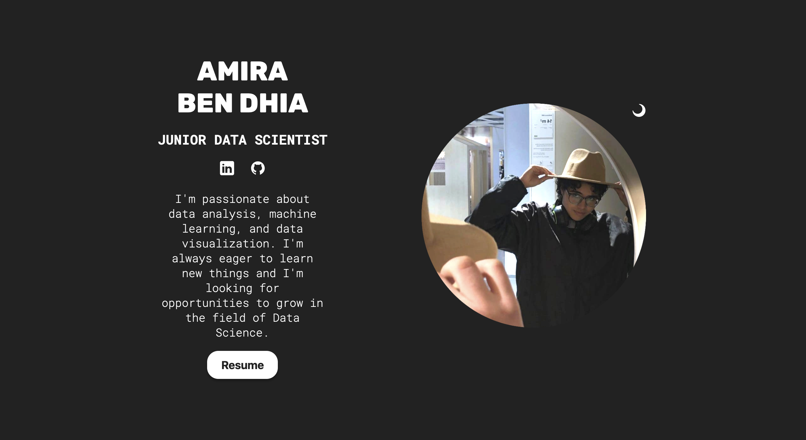
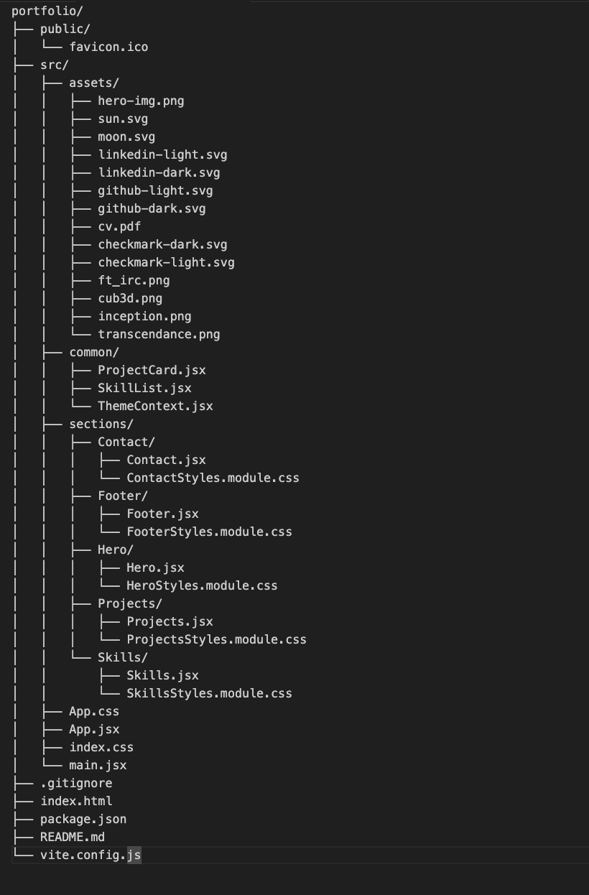

# Portfolio

This is a personal portfolio website built with **React** and **Vite**. The website showcases various sections, including a hero section, projects, skills, and a contact form. It also includes a theme toggle feature to switch between light and dark modes.

---

## Features

- **Hero Section**:  
  Displays a profile picture, name, title, and links to LinkedIn and GitHub profiles. Includes a theme toggle button to switch between light and dark modes.

- **Projects Section**:  
  Lists various projects with images, titles, and descriptions. Each project links to its respective GitHub repository.

- **Skills Section**:  
  Displays a list of skills with icons.

- **Contact Section**:  
  Contains a contact form that submits data to Formspree.

- **Footer**:  
  Displays a copyright notice.

---

## Technologies Used

- **React**: A JavaScript library for building user interfaces.
- **Vite**: A build tool that provides a faster and leaner development experience for modern web projects.
- **CSS Modules**: For scoped and modular CSS styling.
- **Formspree**: For handling form submissions.

---

## Project Structure

---

## Deployment

The website is deployed using **Netlify**.  

### Live Link:
[Portfolio Website](https://aben-dhi-portfolio.netlify.app/)

---

